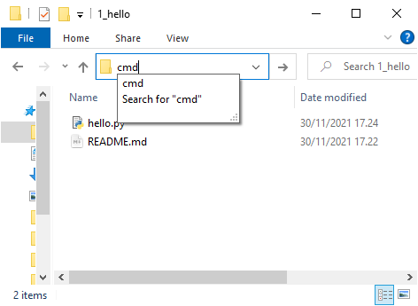
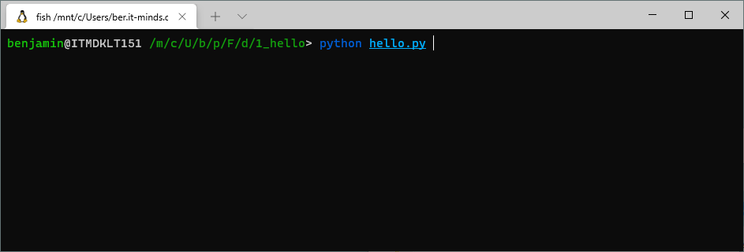

# 1. Kør et python program
Din første opgave er at køre et python program. Et python program slutter altid på *.py*. I denne mappe ligger programmet *hello.py* som vi skal prøve at køre.

## Åben din terminal
Afhængig af din computer er der forskellige måde at tilgå terminalen på.

### Windows terminal - Commando Prompt

[Bonus: Sådan navigerer du i CMD](https://blogs.umass.edu/Techbytes/2014/11/14/file-navigation-with-windows-command-prompt/)

### Mac terminal - Terminal
[Prøv dette](https://www.maketecheasier.com/launch-terminal-current-folder-mac/)

### Linux
You already know!

## Kør dit python program
Nu har du en åben terminal, der ser nogenlunde sådan her ud

Det første del fortæller computeren at den skal bruge Python, den næste fortæller den at python skal åbne filen *hello.py*.
`python hello.py`
Herefter kan du indtaste dit navn og se hvad programmet gør.

## Åben *hello.py* filen
Her kan du se koden der bliver kørt. Du skal være velkommen til at foretage ændringer og se hvad der sker når du prøver at køre programmet igen.

## How to run

Normalt hedder den python fil der skal køres *main.py* og den køres som beskrevet ovenfor. Hvis dette ikke er tilfældet står er der oftest en README.md fil med at afsnit "How to run", som beskriver hvordan programmet skal køres fra terminalen.

`python hello.py`

# Opgaver

## Efternavn
Få programmet til at spørge efter både fornavn og efternavn og print disse.
